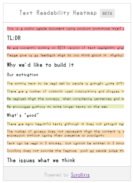

# Scrolliris Readability Reflector

Code Name: `Sierre /syĕr/`

[![pipeline status][pipeline]][commit] [![coverage report][coverage]][commit]
[![npm version][version]][npm]

[pipeline]: https://gitlab.com/scrolliris/scrolliris-readability-reflector/badges/master/pipeline.svg
[coverage]: https://gitlab.com/scrolliris/scrolliris-readability-reflector/badges/master/coverage.svg
[commit]: https://gitlab.com/scrolliris/scrolliris-readability-reflector/commits/master
[version]: https://img.shields.io/npm/v/@lupine-software/scrolliris-readability-reflector.svg
[npm]: https://www.npmjs.com/package/@lupine-software/scrolliris-readability-reflector

  
(minimap)

```txt

  () o
  /\     _   ,_    ,_    _
 /  \|  |/  /  |  /  |  |/
/(__/|_/|__/   |_/   |_/|__/

Sierre; ScrollirIs honEst Readability REflector
```

**Scrolliris Readability Reflector (Sierre)** idnicates text readability
heatmap data which is tracked based on the scroll event in a gentlemanly manner by
[Scrolliris Readability Tracker (Stäfa)](https://gitlab.com/scrolliris/scrolliris-readability-tracker).

This project is text readability indicator by [Scrolliris](
https://about.scrolliris.com).  
It's called *Scrolliris Readability Reflector* as formal.

There are 2 extensions `minimap` and `overlay` which are built using iframe.


## Repository

https://gitlab.com/scrolliris/scrolliris-readability-reflector


## Requirements

* Node.js `8.9.0` (build)
* npm `>= 5.6.0`


## Install

```zsh
: via npm
% npm install @lupine-software/scrolliris-readability-reflector
```

## Configuration

TODO

See `example/index.html`.

```
settings takes...

* endpointURL
* csrfToken
* canvasJS
* canvasCSS
```


## Development

### Building

```zsh
% gulp build
```

### Testing

```zsh
: run all tests on PhantomJS with coverage (`karma start`)
% npm test

: test task runs all tests {unit|functional} both
% gulp test

: run unit tests
% gulp test:unit

: run functional tests on Electron
% gulp test:func
```


## License

```txt
Scrolliris Readability Reflector
Copyright (c) 2017 Lupine Software LLC
```

`GPL-3.0`

The programs in this project are distributed as
GNU General Public License. (version 3)

```txt
This program is free software: you can redistribute it and/or modify
it under the terms of the GNU General Public License as
published by the Free Software Foundation, either version 3 of the
License, or (at your option) any later version.

This program is distributed in the hope that it will be useful,
but WITHOUT ANY WARRANTY; without even the implied warranty of
MERCHANTABILITY or FITNESS FOR A PARTICULAR PURPOSE.  See the
GNU General Public License for more details.

You should have received a copy of the GNU General Public License
along with this program. If not, see <http://www.gnu.org/licenses/>.
```

See [LICENSE](LICENSE).
